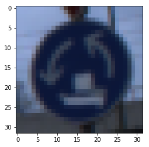
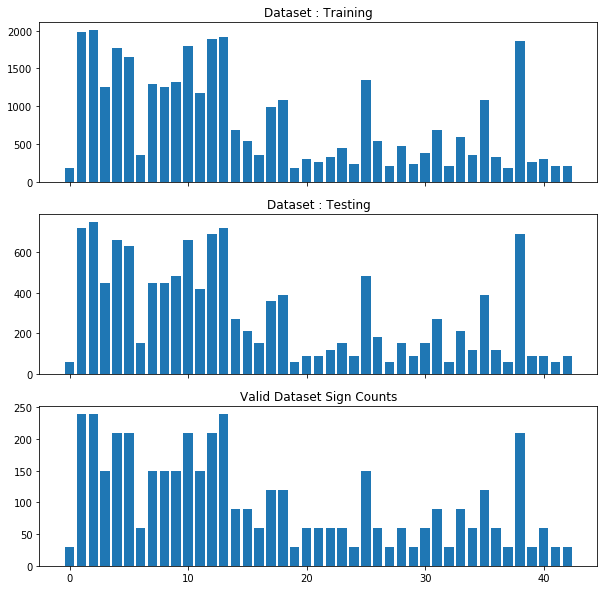
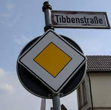
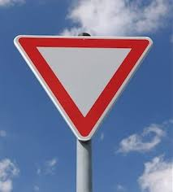
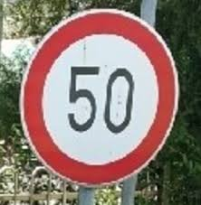
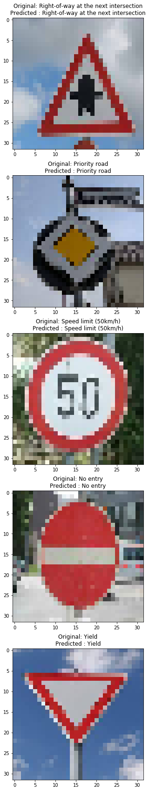

# **Traffic Sign Recognition** 

## The steps for building the Traffic Sign Classifier are as follows:
* Load the data set
* Explore, summarize and visualize the data set
* Design, train, test and experiment different model architectures
* Use the model to make predictions on new images
* Analyze the softmax probabilities of the new images

The steps are explained below

### Load the Data Set
1. Before loading the data set, first the imports of the required modules is done in the same cell.
2. As the data set is available in the form of pickled files, the path to the pickled files are stored in variables.
3. The pickled files are unpickled and the data is loaded.
4. The loaded data is in the form of dictionaries, hence the dat is divided into the following variables
    - `X_train` : The training images
    - `y_train` : The labels for the training images
    - `X_valid` : The images for cross validation
    - `y_valid` : The labels for the cross validation images
    - `X_test` : The testing images for testing after the model is trained
    - `y_test` : The labels for the testing images
5. The `signames.csv` file is also read and converted to a dictionary (`sign_lable_names`) in which the ClassId is the key and the description is the value.

### Data Set Summary & Exploration
Now the data is loaded, the different statistics of the data are explored
1. Total number of training images : 34799
2. Total number of validation images : 4410
3. Total number of testing images : 12630
4. Shape of the input images : (32, 32, 3)
5. Total number of classes : 43

An example of an image from the dataset

Also the number of examples for each class is depicted in a bar graph. The training would be more biased towards the calsses where the training examples are more, but for now I have not done any data augmentation. The plots are shown below:

### Design and Test a Model Architecture

#### 1. Pre Process the images
As it is a known fact that a normalized data set helps in training, the training data and the validation data is normalized by dividing every data point by 255 resulting in a data set with values between 0 and 1. 

The conversion to gray scale was also tested but it did not result in better results after training (shown later in a table), therefore the conversion step is removed.

#### 2. Model Architecture
The final model is a modified LeNet Model with the following architecture
1. Conv Layer 1
   1. Input : 32 x 32 x 3
   2. Filter : 5 x 5 x 3 x 16
   3. Activation : Relu
   4. Output : 28 x 28 x 16
2. Max Pool 1
   1. Input : 28 x 28 x 16
   2. Kernel = 1 x 2 x 2 x 1
   3. Stride = [1, 2, 2, 1]
   4. Padding : Valid
   5. Output : 14 x 14 x 16
3. Conv Layer 2
   1. Input : 14 x 14 x 16
   2. Filter : 5 x 5 x 16 x 32
   3. Activation : Relu
   4. Output : 10 x 10 x 32
4. Max Pool 2
   1. Input : 10 x 10 x 32
   2. Kernel = 1 x 2 x 2 x 1
   3. Stride = [1, 2, 2, 1]
   4. Padding : Valid
   5. Output : 5 x 5 x 32
5. FC 1 (with dropout)
   1. Input : 800
   2. Weights : 800 x 500
   3. Biases : 500
   4. Activation : Relu
   5. Output : 500
6. FC 2 (with dropout)
   1. Input : 500
   2. Weights : 500 x 100
   3. Biases : 100
   4. Activation : Relu
   5. Output : 100
7. 6. FC 3
   1. Input : 100
   2. Weights : 100 x 43
   3. Biases : 43
   4. Output : 43

#### 3. Model Training, Hyper Paremeters
**Hyper parameters chosen**
- Epochs : 300
- Batch Size : 8
- Learning Rate : 0.00001
- Keep Probability (dropout) : 0.3
- L2 Scale : 1e-3
The reason that the dropout probability is very high with a very low L2 Regularization is that the model was overfitting al lot. It was reaching 100% Training accuracy with validation accuracy below 93% and test accuracy below 90%.

Other architectures with different hyperparametes were also tested. But the above mentioned hyper parameters and the above mentioned architecture was selected as it was with the best reesults. The other experiments are documented in the file [experiments.md](./experiments.md)

**Steps in training the model**
1. First the hyper parameters are assigned to different variables
2. Plave holders are created for the input images, the lables, the keep probability for dropout and the output lables are one hot encoded.
3. The logits and the weights are initalized by calling the function that returns the model to be trained and a list of weights for L2 regularization.
4. The soft max cross entropy is calculated
5. The L2 regularizer is calculated
6. The loss is then calculated using the `tf.reduce_mean` function with the cross entropy as input.
7. To the calculated loss, the L2 regularizer is added (multiplied with L2 Scale)
8. This was the forward propagation. And now the optimizer (Adam Optimizer) is initialized with the pre defined learning rate for the back propogation.
10. The back propogation is initialized to minimize the Loss
11. To evaluate the model a `evaluate` function is defined which returns the accuracy of the model.

With everything defined, the model training is started for the predefined epochs.
The final accuracy achieved is as follows
- Training Accuracy : 99.9%
- Validation Accuracy : 96.5%
- Testing Accuracy : 95.16%

### Test a Model on New Images

#### 1. 5 German Traffic Signs for testing
1. 
2. 
3. 
4. 
5. 

#### 2. Prediction of the model on the above images

Here are the results of the prediction:

Surprisingly, the accuracy on these 5 images is 100%. I would like to test them on some more images later on.
I am pretty sure that this is just a statistical anamoly.

#### 3. Describe how certain the model is when predicting on each of the five new images by looking at the softmax probabilities for each prediction. Provide the top 5 softmax probabilities for each image along with the sign type of each probability. (OPTIONAL: as described in the "Stand Out Suggestions" part of the rubric, visualizations can also be provided such as bar charts)

As mentioned above, the model detected the images with 100% accuracy (and I believe it is a statistical anamoly). When the soft max values are seen, there also the results are surprising. The model detects each image with 100% probability.

